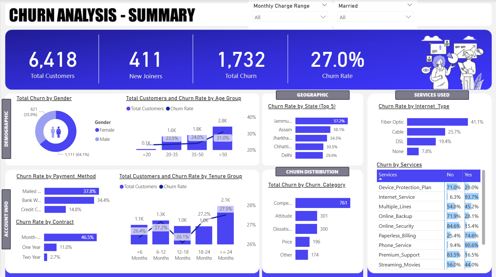
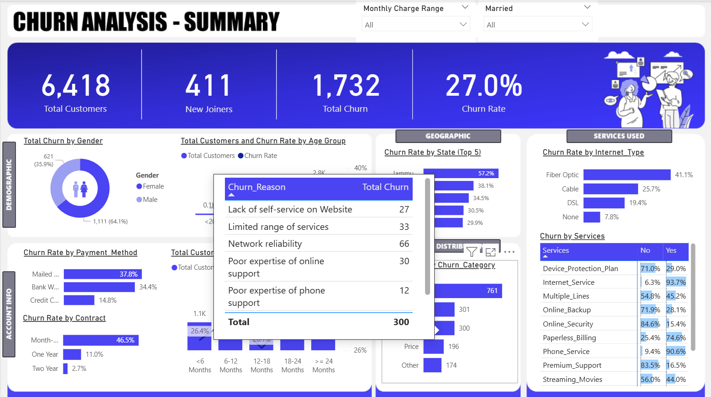

# Customer Churn Analysis
### 📌 Project Overview
This project is focused on Customer Churn Analysis for a telecom dataset. The goal is to identify patterns and reasons for customer churn by analyzing demographic, geographic, service usage and account information. A Power BI dashboard has been built to provide insights through interactive visualizations.

### 🏢 Business Problem
Customer churn is one of the biggest challenges for telecom companies. High churn rates lead to revenue loss and increased customer acquisition costs. The company needs a centralized dashboard to:
- Monitor churn rate and customer growth
- Understand customer behavior across demographics, services, and geography
- Identify risk factors leading to churn
- Support data-driven decision making to improve customer retention

### 🎯 Key Insights & KPIs
The dashboard tracks important churn metrics, including:
#### KPIs:
- Total Customers, New Joiners, Total Churn, Churn Rate
#### Visualizations:
Demographic:
- Donut chart – churn by gender
- Line & stacked column chart – total customers & churn rate by age

Geography:
- Clustered bar chart – churn rate by state (Top 5)

Services Used:
- Clustered bar chart – churn rate by internet type

Account Info:
- Clustered bar chart – churn by payment method
- Clustered bar chart – churn by contract type

Tenure Groups:
- Line & stacked column chart – total customers & churn rate by tenure group

Churn Distribution:
- Clustered bar chart – churn by category

Services:
- Matrix – Churn count by services used

### 🛠 Tech Stack
- Data Storage & Exploration: MySQL Workbench
- Data Visualization: Power BI
- Data Source: Excel dataset imported into MySQL
- Integration: Power BI connected to MySQL views

### 📑 Project Workflow
- Imported raw Excel data into MySQL
- Performed data cleaning & exploration in MySQL
- Created views for structured reporting
- Connected Power BI to MySQL views
- Built an interactive dashboard with churn insights

### 💡 Key Learning
- End-to-end BI pipeline (Excel → MySQL → Power BI)
- Customer churn analytics & KPI monitoring
- Data storytelling with interactive dashboards

### Dashboard

